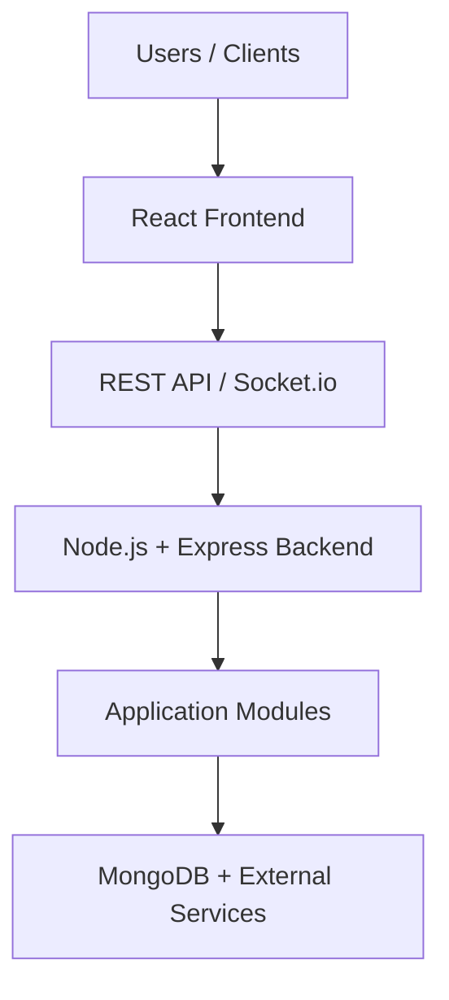

# EventSphere AI — Architecture Overview

## Overview

EventSphere AI is designed as a modular, scalable Intelligent Event Operations Platform. This document outlines the high-level architecture agreed upon for the platform baseline.

> **Note:** The detailed architecture and component boundaries will evolve iteratively as development progresses.

## High-Level Architecture Diagram

## Architectural Layers

1. **Client Layer**: Single Page Application built with React.
2. **Communication Layer**: Standardized REST API endpoints for synchronous operations and Socket.io for real-time notifications/updates.
3. **Application Layer**: Node.js and Express backend routing requests to modular domain services.
4. **Data & External Services Layer**: MongoDB document database for persistent data storage alongside external third-party integrations.
